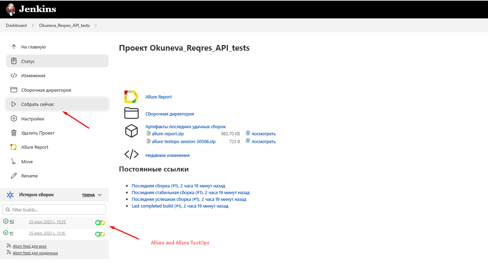
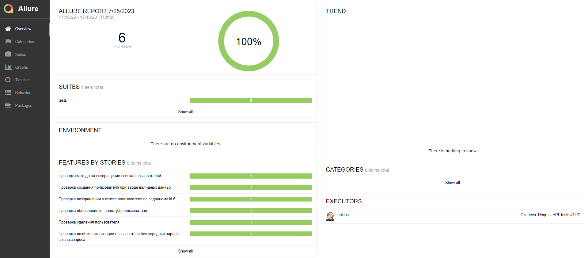
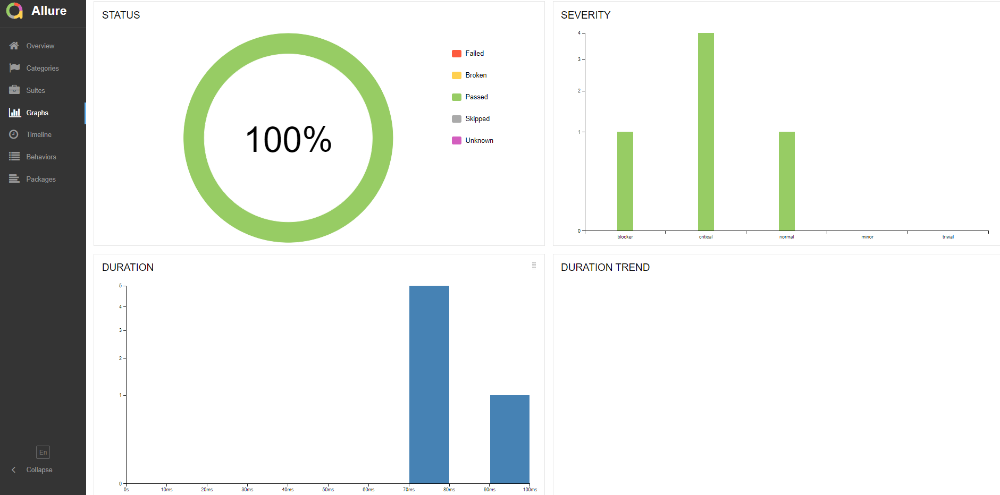
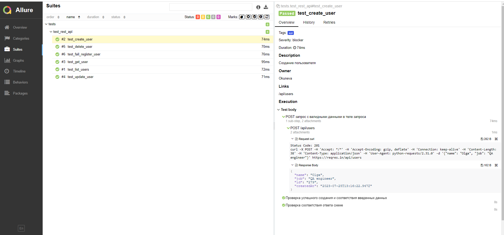
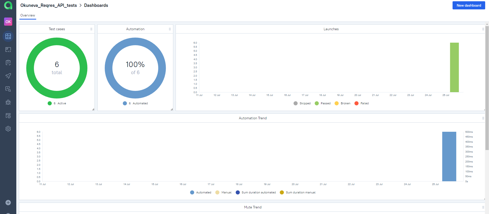
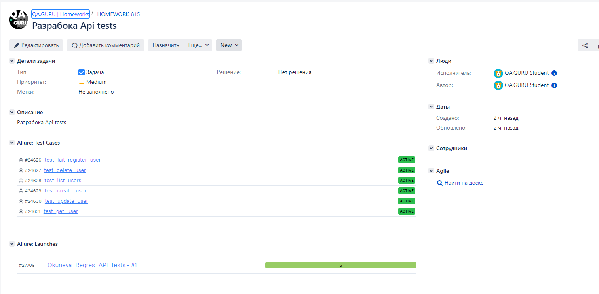

# Проект по тестированию сайта Reqres.ru
> <a target="_blank" href="https://reqres.in/">Ссылка на сайт</a>


<!-- Технологии -->
### Проект реализован с использованием:
<p  align="center">
  <code></code>
  <code></code>
  <code></code>
  <code></code>
  <code></code>
  <code></code>
  <code></code>
</p>

<!-- Тест кейсы -->

### Что проверяем
✓ Запрос списка пользователей  
✓ Создание пользователя при вводе валидных данных  
✓ Получаение пользователя по переданному id  
✓ Обновление пользователя  
✓ Удаление пользователя  
✓ Ошибка авторизации с пустым обязательным полем password  


###  Запуск проекта в Jenkins

### [Job](https://jenkins.autotests.cloud/job/Okuneva_Reqres_API_tests/)

##### При нажатии на "Собрать сейчас" начнется сборка тестов и их прохождение.


<!-- Allure report -->
## Локальный запуск автотестов
Пример командной строки:
```bash
pytest .
```

Получение отчёта:
```bash
allure.bat serve
```
<!-- Allure TestOps -->


###  Allure report.
### [Report](https://jenkins.autotests.cloud/job/Okuneva_Reqres_API_tests/2/allure/)
##### После прохождения тестов, результаты можно посмотреть в Allure отчете, где так же содержится ссылка на Jenkins


##### Во вкладке Graphs можно посмотреть графики о прохождении тестов, по их приоритезации, по времени прохождения и др.


##### Во вкладке Suites находятся собранные тест кейсы, у которых описаны шаги и приложены Request curl и Response Body



<!-- Allure TestOps -->

###  Интеграция с Allure TestOps

### [Dashboard](https://allure.autotests.cloud/project/3562/dashboards)

##### Так же вся отчетность сохраняется в Allure TestOps, где строятся аналогичные графики.


#### Во вкладке со сьютами, мы можем:
- Управлять всеми тест-кейсами или с каждым отдельно
- Перезапускать каждый тест отдельно от всех тестов
- Настроить интеграцию с Jira


<!-- Jira -->

###  Интеграция с Jira
##### Настроив через Allure TestOps интеграцию с Jira, в тикет можно пробросить результат прохождение тестов и список тест-кейсов из Allure




